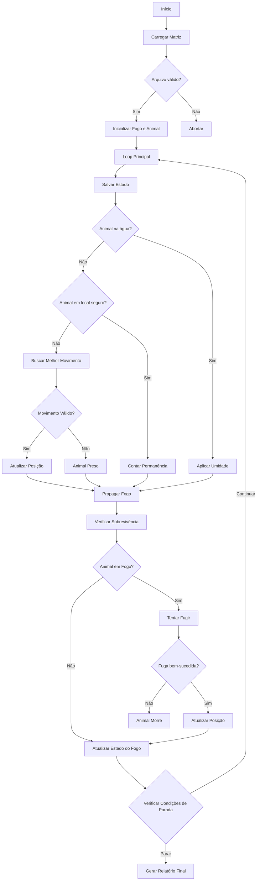

```mermaid
graph TD
    A[Início] --> B[Carregar Matriz]
    B --> C{Arquivo válido?}
    C --> |Sim| D[Inicializar Fogo e Animal]
    C --> |Não| E[Abortar]
    D --> F[Loop Principal]
    F --> G[Salvar Estado]
    G --> H{Animal na água?}
    H --> |Sim| I[Aplicar Umidade]
    H --> |Não| J{Animal em local seguro?}
    J --> |Sim| K[Contar Permanência]
    J --> |Não| L[Buscar Melhor Movimento]
    L --> M{Movimento Válido?}
    M --> |Sim| N[Atualizar Posição]
    M --> |Não| O[Animal Preso]
    N --> P[Propagar Fogo]
    O --> P
    K --> P
    I --> P
    P --> Q[Verificar Sobrevivência]
    Q --> R{Animal em Fogo?}
    R --> |Sim| S[Tentar Fugir]
    S --> T{Fuga bem-sucedida?}
    T --> |Sim| U[Atualizar Posição]
    T --> |Não| V[Animal Morre]
    R --> |Não| W[Atualizar Estado do Fogo]
    U --> W
    W --> X{Verificar Condições de Parada}
    X --> |Continuar| F
    X --> |Parar| Y[Gerar Relatório Final]
```
